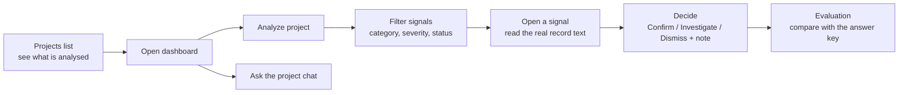
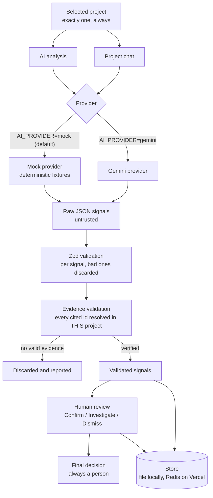
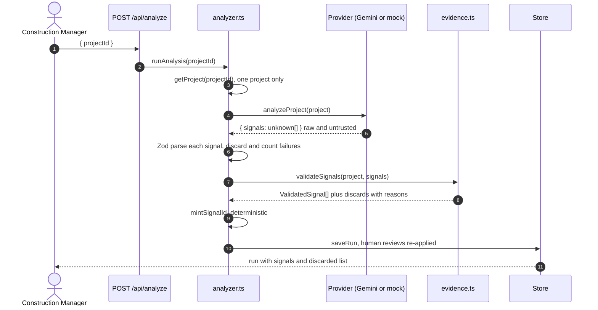
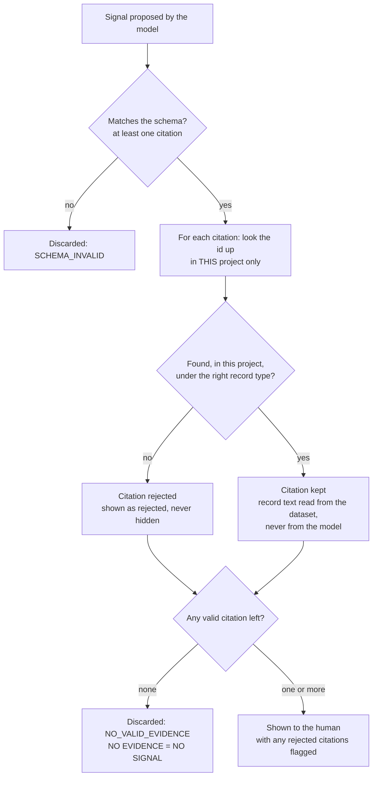
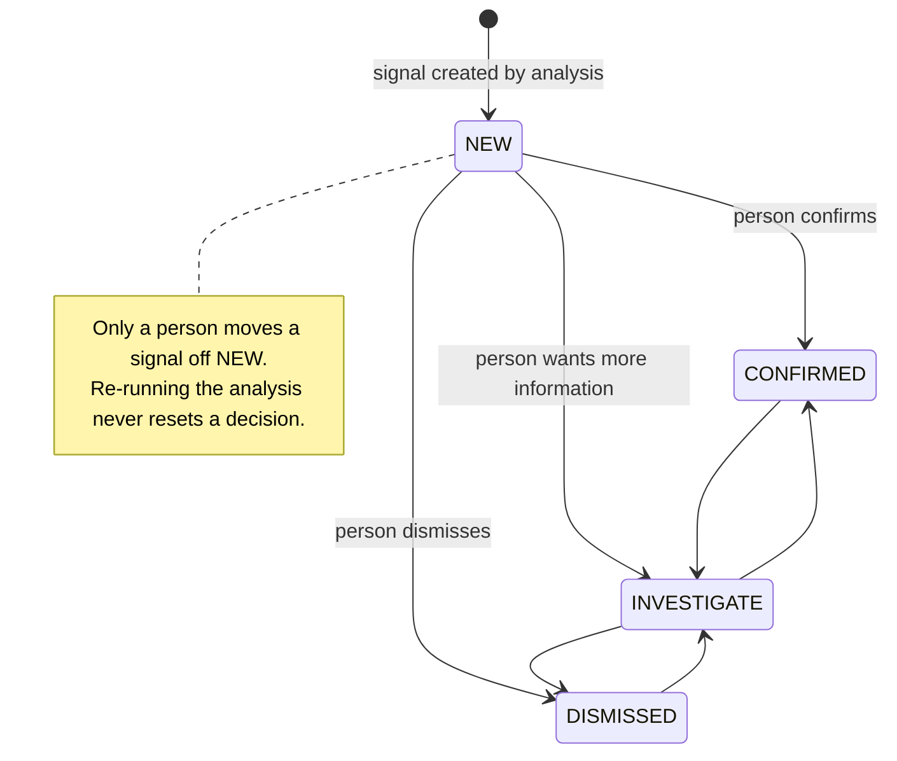
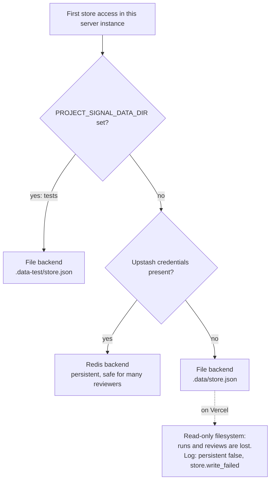
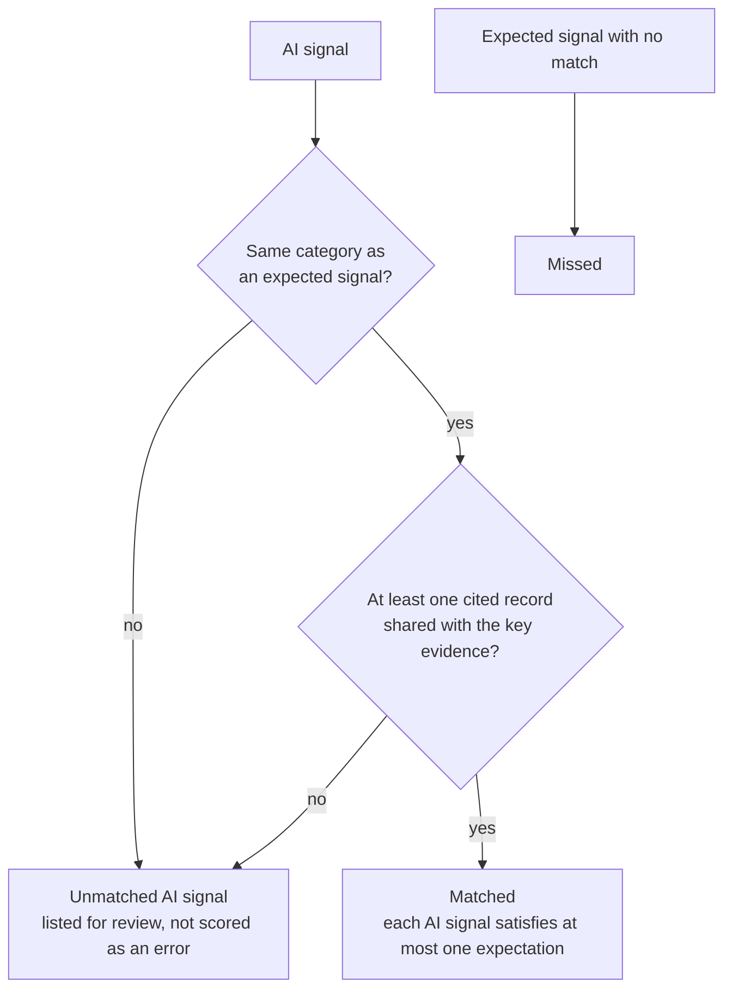

# Project Signal

## One-Line Description

**AI-Assisted Construction Project Intelligence** — a prototype that reads across fragmented project records, proposes evidence-backed signals that may warrant review, verifies every citation, and leaves the decision to a person.

Built for an AI Practice Consultant assignment at M Moser Associates, from the Construction Manager's perspective. It is a prototype demonstrating an AI-assisted workflow. It is not a construction management platform.

---

## Table of contents

1. [Problem Statement](#problem-statement)
2. [Objective](#objective)
3. [Key Features](#key-features)
4. [User Workflow](#user-workflow)
5. [Demo / Live Deployment](#demo--live-deployment)
6. [Demo Scenarios](#demo-scenarios)
7. [Screenshots](#screenshots)
8. [Architecture Overview](#architecture-overview)
9. [Technology Stack](#technology-stack)
10. [Project Structure](#project-structure)
11. [AI Architecture](#ai-architecture)
12. [AI Prompting Strategy](#ai-prompting-strategy)
13. [Hallucination & Evidence Safeguards](#hallucination--evidence-safeguards)
14. [Human-in-the-Loop](#human-in-the-loop)
15. [Dataset & Data Model](#dataset--data-model)
16. [Synthetic Data Disclaimer](#synthetic-data-disclaimer)
17. [Gemini Integration](#gemini-integration)
18. [Mock / Demo Mode](#mock--demo-mode)
19. [Environment Variables](#environment-variables)
20. [Local Installation](#local-installation)
21. [Local Development](#local-development)
22. [Testing](#testing)
23. [Manual Gemini Testing](#manual-gemini-testing)
24. [Vercel Deployment](#vercel-deployment)
25. [Vercel Environment Variables](#vercel-environment-variables)
26. [Production Configuration](#production-configuration)
27. [Evaluation Methodology](#evaluation-methodology)
28. [Limitations](#limitations)
29. [Security Considerations](#security-considerations)
30. [Design Decisions & Trade-offs](#design-decisions--trade-offs)
31. [Production Improvements / Future Roadmap](#production-improvements--future-roadmap)
32. [Known Issues](#known-issues)
33. [License](#license)
34. [Author / Contact](#author--contact)

---

## Problem Statement

> Project information is scattered across drawings, models, specifications, meetings, messages and site reports. We often recognise problems too late. Could AI help us see emerging problems earlier?

A meeting note saying an approval is still outstanding is unremarkable. A site report saying a crew stood down is unremarkable. A contractor email asking for a date is unremarkable. Read together, in order, they describe a work front that has been stopped for three weeks.

Nobody misses this because they are careless. They miss it because the three records live in three different places and nobody reads them side by side.

## Objective

Explore whether AI can help a **Construction Manager** notice emerging problems earlier by reading across fragmented records, **without** asking anyone to trust the AI blindly.

The one principle everything serves:

> **The LLM proposes evidence-backed signals. The application verifies the evidence. The human makes the decision.**

If a change weakens any of those three clauses, it is the wrong change.

## Key Features

- **Signal analysis.** Select a project and analyse it. The AI proposes potential signals in seven categories (dependency, repeated issue, unresolved decision, change, schedule warning, missing information, inconsistency), each citing the records it relied on.
- **Evidence verification.** Every citation is resolved against the selected project before anything is shown. No verifiable evidence means no signal.
- **Human review.** Confirm, Investigate or Dismiss each signal, with a note. The decision persists and survives re-analysis. The panel shows when it was last updated.
- **Filterable signals.** Tabs by category, plus severity and review-status filters, each with live counts.
- **Project chat.** Ask questions about the selected project. It sees only that project and cites record ids.
- **Projects list.** One row per project showing whether it has been analysed, when it was last updated, and how many signals are reviewed.
- **Evaluation page.** Compares stored analyses against a hidden answer key. Every AI signal carries its human-review tag and can be filtered by it.
- **Hover explanations.** Every tag, figure and decision button explains itself on hover or keyboard focus.
- **Demo mode by default.** Works with no API key and spends no tokens.
- **Structured logging.** One-line JSON events for debugging a deployment. No secrets and no record text are logged.

## User Workflow

1. **Select a project** from `/projects`. Rows show which are analysed.
2. **Analyze** on the dashboard. Signals appear with their evidence.
3. **Filter** the signals by category tab, severity or review status.
4. **Open a signal** to see the explanation and the actual record text behind each citation.
5. **Decide:** Confirm, Investigate or Dismiss, with a note. Your decision persists.
6. **Ask about this project** in the chat panel.
7. **Evaluation** at `/evaluation` compares what the AI found against the answer key and lets you filter by the decisions people made.



## Demo / Live Deployment

**Live deployment:** _not yet published_. Add the URL here after deploying (see [Vercel Deployment](#vercel-deployment)).

**Run it locally in one minute, with no API key:**

```bash
npm install
npm run dev
```

Open <http://localhost:3000>. The header shows **AI Provider: Demo Mode**.

## Demo Scenarios

Each of the five synthetic projects is designed to exercise something different. These are the outcomes you should see in **demo mode**, which uses deterministic fixtures and goes through the real validation pipeline.

Across all five projects, demo mode yields **12 of 12 expected signals matched, 0 missed, 3 unmatched AI signals, and 2 of 2 absences respected**.

### P001 · Riverside Commercial Tower (Bengaluru) — a dependency chain and a deliberately bad citation

An outstanding HVAC ductwork approval for Levels 7 to 9 sits in a meeting note, an issue, a dependency, several site reports and contractor updates. No single record says "the ceiling works are stalled". Together they do.

- **Click Analyze.** Four signals appear: the HVAC **Dependency** (High), the unresolved Level 8 duct and sprinkler clash **Decision** (High), the contractor's **crew release notice** for 20 July (Medium), and a Low **storage-at-capacity** observation.
- **Watch the evidence guard.** The first signal cites a record that does not exist (`P001-SR999`). The signal survives on its valid citations and its card says one cited record could not be verified.
- **Try:** filter to **High** severity, then open the HVAC signal to read the real record text behind each citation.

### P002 · Harbourfront Workplace Refurbishment (Hong Kong) — repeated failures and a cross-project citation

Washroom flood tests have failed at the same threshold detail on three separate floors.

- **Click Analyze.** Three signals appear: **Repeated issue** (High), **Missing information** (a hold point never added to the test plan), and an **Unresolved decision** (a method statement still in draft).
- **Watch the evidence guard.** A fourth proposed signal cites only real records from **P001**. It is **discarded entirely**, and a "Validation" card on the dashboard names it and says why. Cross-project citations cannot resolve.
- **Try:** the completion dates are amber, because current completion differs from planned (26 Feb → 19 Mar 2027).

### P003 · Marina Bay Regional Headquarters (Singapore) — a decision holding up other work, with a deadline

A facade panel material has been "under selection" since April across multiple meetings.

- **Click Analyze.** Four signals appear: the **Unresolved decision**, the **Dependency** (three work packages held by that decision), a **Schedule warning** (reserved fabrication capacity lapses on 30 September, against an installation window opening 2 November), and a Low stored-finishes observation.
- **Try:** use the category tabs to view only **Dependency**, and read the wording. It says records "suggest" and "may warrant review", never "will cause a delay".

### P004 · Clerkenwell Studio Campus (London) — accumulating change

Several small changes pile up against the same delivery period and eat the float.

- **Click Analyze.** Four signals appear: a **Change** signal grouping three changes, a **Schedule warning** (practical completion moved 29 Jan → 19 Feb 2027 with no float left), an **Unresolved decision** on the lost commissioning week, and a Low signal about unvalued abortive work.
- **Try:** open the **Change** signal. Its evidence spans lighting, a client-instructed meeting room and a raised floor delivery.

### P005 · Lower Parel Innovation Hub (Mumbai) — the trap: nothing active to raise

This project contains two issues that **look** concerning but were **already resolved**: Level 2 screed moisture (investigated, repaired, retested twice, accepted) and quiet-room acoustic performance.

- **Click Analyze.** **No signals appear**, and the page says: _"No potential signals were identified from the available project information."_ It does **not** say there are no risks.
- **Why it matters:** a system that raises the moisture issue has failed, even though every record it would cite is real. Only the evaluation's absence check catches that. On `/evaluation`, both absences show **Respected**.

### A short end-to-end demo (about three minutes)

1. `/projects` — note all five are **Not analysed**.
2. Open **P001**, click **Analyze project**. Read the four signals; note the rejected-citation warning.
3. Click the **Dependency** tab, then the **High** severity chip. Counts on every control update.
4. **View signal** on the HVAC dependency. Hover the badges to read what each means.
5. Choose **Investigate**, add a note, **Save review**. The panel shows _Decision last updated …_.
6. Back on `/projects`: P001 is now **✓ Analysed** with the time and "1/4 reviewed".
7. Analyse **P002** and note the discarded cross-project signal. Analyse **P005** and note the empty result.
8. Open `/evaluation`. Click the **Investigating** tab to see your decision, tagged on the signal.
9. Ask the chat panel on any project: _"Which decisions are still unresolved?"_

## Screenshots

Screenshots are not committed yet. Capture these in demo mode and save them to `docs/screenshots/`, then reference them here:

| Screen | Suggested file | What to show |
|---|---|---|
| Projects list | `docs/screenshots/projects.png` | Analysed and Not analysed tags, last-updated times |
| Dashboard with signals | `docs/screenshots/dashboard.png` | Category tabs and filter chips |
| Evidence guard | `docs/screenshots/evidence-guard.png` | P002's discarded-signal "Validation" card |
| Signal detail | `docs/screenshots/signal.png` | AI signal, evidence text, review panel |
| Evaluation | `docs/screenshots/evaluation.png` | Summary figures and human-review tabs |
| Hover explanation | `docs/screenshots/tooltip.png` | A tooltip on a decision button |

```md

```

## Architecture Overview



Dependencies flow one way: `app/` and `components/` → `lib/` → `data/`. `lib/` never imports from `app/` or `components/`.

## Technology Stack

| Layer | Choice |
|---|---|
| Framework | Next.js 16 (App Router), React 19, TypeScript |
| Styling | Tailwind CSS 4, light theme only |
| AI | Google Gemini via `@google/genai` (default model `gemini-2.5-flash`), plus a deterministic mock provider |
| Validation | Zod 4 |
| Persistence | JSON file locally, Upstash Redis on Vercel (`@upstash/redis`) |
| Testing | Vitest 5 (mock provider only) |
| Hosting | Vercel |

## Project Structure

```
app/              Routes: home, projects, dashboard, signal detail, evaluation, API
components/       Presentational React. Knows about types, never about providers.
  dashboard/      Analysis panel, record tabs
  signals/        Signal card, signal list with filters, review panel
  evaluation/     Human-review filter and per-project breakdown
  chat/           Project chat
  ui/             Primitives, tooltip, shared explanation text
lib/ai/           Providers, prompts, schemas, orchestration
lib/projects/     The only module that reads data/projects.json
lib/validation/   Evidence validation — the trust boundary
lib/signals/      Deterministic signal id minting
lib/store/        Runs and human reviews: file backend and Redis backend
lib/evaluation/   The only module that reads data/evaluation.json
lib/logging/      Structured server-side logging
data/             projects.json (5 projects, 156 records) · evaluation.json (answer key)
tests/            Vitest, mock provider only
docs/             DATA_MODEL · AI_DESIGN · EVALUATION · MANUAL_GEMINI_TESTING
```

## AI Architecture



Two type names carry the whole trust model. `RawSignal` came out of a model and is untrusted. `ValidatedSignal` has had every citation resolved against the selected project and is safe to render. Nothing converts one to the other except `lib/validation/evidence.ts`.

**Project isolation is a property of the function signature.** Both providers take a single `Project` and nothing else, so there is no parameter through which a second project, or the answer key, could travel.

**What is sent to Gemini.** Only the selected project: a header (id, name, type, location, client, status, description, dates) and **four record collections** — meetings, site reports, issues and changes — as plain text, plus the prompt. That is a fraction of the full project, which is about 3–4k tokens. Decisions, dependencies and contractor/consultant updates are not sent. The model's response schema restricts citations to those four kinds, so it cannot cite a record it was never shown. The constant `SENT_SOURCE_TYPES` in `lib/ai/gemini.ts` controls this.

## AI Prompting Strategy

There are exactly **two** global prompts in `lib/ai/prompts.ts`, and never more:

- `ANALYSIS_PROMPT` — a structured sweep of one project's records.
- `PROJECT_CHAT_PROMPT` — answering one question about one project.

They are separate because they fail differently. Analysis produces a reviewable artefact and must return structured JSON. Chat produces prose and must be willing to say "the available records do not cover this".

Principles in the analysis prompt:

- **Scope:** analyse only the supplied project; no knowledge of any other.
- **Read across records**, not within one: dependencies, repeated issues, unresolved decisions, changes, schedule warnings, missing information, inconsistencies.
- **Evidence is mandatory:** cite exact ids, never invent one. **NO EVIDENCE = NO SIGNAL.** An empty result is a valid answer.
- **Temporal reasoning:** if a later record shows something was resolved, it is not an active signal.
- **Prohibitions:** no invented people, dates or events; no predictions; no blame; no decisions; no delay durations unless a record states one.
- **Language of review:** "may warrant review", "records suggest", never "this will cause a delay". Confidence is proportional to evidence; severity is attention, not a forecast.

**No prompt mentions any scenario in the dataset** (HVAC, waterproofing, facades). A prompt that named the scenarios would be recognising itself rather than reading the records. `tests/isolation.test.ts` asserts this.

Generation uses `temperature: 0.2`, because the task is reading records, not writing prose, and a JSON response schema constrains categories, severities and source types.

## Hallucination & Evidence Safeguards

| Safeguard | Where |
|---|---|
| Structured output schema constrains enums and cited source types | `lib/ai/gemini.ts` |
| Per-signal Zod parse; malformed signals discarded and counted, never repaired | `lib/ai/analyzer.ts` |
| At least one citation required by the schema | `lib/ai/schemas.ts` |
| Every citation resolved in the selected project only | `lib/validation/evidence.ts` |
| Evidence text read from the dataset, **never from the model** | `lib/validation/evidence.ts` |
| A signal with zero valid evidence is discarded entirely | `lib/validation/evidence.ts` |
| Duplicate citations collapsed | `lib/validation/evidence.ts` |
| Signal id and review status minted server-side, never by the model | `lib/signals/ids.ts`, `lib/store/` |
| Rejections counted, shown in the UI and logged | `lib/ai/analyzer.ts`, `components/dashboard/analysis-panel.tsx` |
| Temporal rule in the prompt; P005 tests it | `lib/ai/prompts.ts`, `data/` |



Three citation failures are caught: an id that does not exist, an id that belongs to another project, and a real id filed under the wrong record type. A partially valid signal survives on its good citations, and the rejected ones are displayed as rejected — visible, never silently dropped.

Chat citations are resolved the same way but more leniently: an unresolvable id is dropped without discarding a useful answer, and the count is logged.

**Evidence validation proves a cited record exists and is quoted accurately. It does not prove the reasoning about it is sound.** That is exactly why a human reviews it.

## Human-in-the-Loop



- The AI **never sets a review status.** `saveReview` in `lib/store` is the only writer, and nothing in `lib/ai` may call it.
- `POST /api/review` imports no provider, analyzer or chat module. The separation is structural: an AI code path has no way to reach the function that records a decision.
- Reviews are stored separately from runs, keyed by signal id, and re-applied when a run is read. **Re-running an analysis replaces the run but never the reviews.** Signal ids are derived from content (project, category, cited records), so a re-discovered signal keeps its review.
- Signal detail pages separate **AI signal** from **Human review**, and the review panel shows when the decision was last updated.
- AI language is "may warrant review", never "this will cause a delay". An empty analysis says no potential signals were identified from the available information, never "there are no risks".
- Historical issues that were explicitly resolved are not surfaced as active. P005 exists to test exactly this.

## Dataset & Data Model

`data/projects.json` holds **5 synthetic projects and 156 records**. Each project has eight record collections:

| Collection | Contents |
|---|---|
| `meetings` | Weekly progress meetings with attendees and notes |
| `siteReports` | Site observations by area |
| `issues` | Raised, open and closed issues |
| `decisions` | Decisions with owner and status |
| `changes` | Scope, product, delivery or programme changes |
| `dependencies` | Predecessor/successor relationships |
| `contractorUpdates` | Updates from contractors and trades |
| `consultantUpdates` | Updates from consultants |

Record ids are globally unique and prefixed with the project, for example `P001-M001` (meeting) or `P002-I003` (issue), so a foreign citation can never resolve by accident. `plannedCompletion` and `currentCompletion` are separate so drift is visible without being labelled a delay.

**No field names the finding.** There is no `risk`, `expectedSignal` or `isProblem` field, and `tests/dataset.test.ts` asserts their absence. The scenarios are in the prose, the way they would be in real records.

`data/evaluation.json` is the **answer key**. It is read only by `lib/evaluation` and never reaches a provider. See [docs/DATA_MODEL.md](docs/DATA_MODEL.md).

## Synthetic Data Disclaimer

**All project information in this repository is synthetic.** The projects, clients, people, dates and events are invented. Any resemblance to real projects is coincidental. AI outputs are suggestions for human review, not project decisions.

## Gemini Integration

`GeminiProvider` (`lib/ai/gemini.ts`) serialises the selected project, sends it with the global prompt and a JSON response schema, and returns raw output for validation.

- Selected with `AI_PROVIDER=gemini`. The key is read from `GEMINI_API_KEY` on the server only.
- The module is `server-only` and imported lazily, so neither the SDK nor the key ever loads into a mock-mode process or a browser bundle.
- **There is no automatic fallback to the mock.** If Gemini is selected and fails (missing key, timeout, rejection, unreadable response) the failure is reported. A silent fallback would show fixture output to someone who believes they are looking at real model output.
- Each call has a 45-second timeout.
- The file contains **no per-project branching**. If `if (project.id === ...)` ever appears in the Gemini path, the prototype has stopped demonstrating anything.
- Each call logs model, prompt size, latency, token usage and finish reason, never prompt or response text.

## Mock / Demo Mode

`MockAIProvider` is the default. It returns deterministic fixtures, so tests, browser checks, CI, local development and the public demo cost **zero Gemini tokens**.

The mock returns **raw, unvalidated** output and goes through the same Zod parsing and evidence validation as a real Gemini response. What you see in demo mode is the real pipeline, not a shortcut around it.

Two fixtures deliberately cite unverifiable records so you can watch the guard work without waiting for a model to hallucinate. **Do not "fix" them.**

- **P001** cites `P001-SR999`, which does not exist. The signal survives and the card reports one rejected citation.
- **P002** contains a signal citing only P001 records. It is discarded entirely and the dashboard says why.

Fixtures are keyed by project id in `lib/ai/fixtures/analysis-fixtures.ts`, the only place a project id selects an outcome. The mock's chat is not a per-project script; it classifies the question and answers from whatever project it is given. In demo mode the fixtures may cite all eight record kinds, whereas Gemini is shown four.

## Environment Variables

Copy `.env.example` to `.env.local`. **None are required** to run in demo mode.

| Variable | Default | Purpose |
|---|---|---|
| `AI_PROVIDER` | `mock` | `mock` for demo fixtures, `gemini` for real calls. Any other value throws `UnknownProviderError`. |
| `GEMINI_API_KEY` | empty | Google Gemini key. Read only when `AI_PROVIDER=gemini`. Server-side only. |
| `GEMINI_MODEL` | `gemini-2.5-flash` | Model used for analysis and chat. |
| `UPSTASH_REDIS_REST_URL` | unset | Redis REST URL. Enables persistent storage on Vercel. |
| `UPSTASH_REDIS_REST_TOKEN` | unset | Redis REST token. |
| `KV_REST_API_URL`, `KV_REST_API_TOKEN` | unset | Alternative names Vercel's Upstash integration may set. Either pair works. |
| `PROJECT_SIGNAL_DATA_DIR` | `.data` | Directory for the file store. Forces the file backend. Used by the tests. |

## Local Installation

Requires Node.js 20 or later.

```bash
git clone https://github.com/abhilasham214/project-signal.git
cd project-signal
npm install        # no API key needed
```

## Local Development

```bash
npm run dev        # http://localhost:3000, demo mode by default
npm run build      # production build; makes no AI provider calls
npm run typecheck  # tsc --noEmit
```

To use real Gemini locally:

```bash
cp .env.example .env.local
```

```env
AI_PROVIDER=gemini
GEMINI_API_KEY=your_key_here
GEMINI_MODEL=gemini-2.5-flash
```

**Restart the dev server after editing `.env.local`.** Next.js reads env files at startup. The header changes to **AI Provider: Gemini**.

Locally, runs and reviews are stored in `.data/store.json` (gitignored). If you see a Gemini error in the browser, the reason is in the terminal running `npm run dev`: look for `gemini.call.failed`.

## Testing

```bash
npm test           # Vitest, forced to the mock provider
```

Every test uses the mock provider. `vitest.config.ts` sets `AI_PROVIDER=mock` for every run, overriding any `.env.local`, so the suite is structurally incapable of spending tokens. Tests write to `.data-test/`, never your real store, and never reach a real Redis.

Coverage: dataset integrity, AI schema acceptance and rejection, evidence validation (including cross-project rejection), project isolation, chat isolation, answer-key isolation, payload contents, human review persistence across re-analysis, evaluation matching, and provider safety.

No provider is called during render, `generateStaticParams` or module scope. Analysis and chat happen **only** in `POST /api/analyze` and `POST /api/chat`, so `next build` and page loads cannot spend tokens.

## Manual Gemini Testing

Real Gemini is exercised **by hand only**. Nothing automated calls it.

1. Set `AI_PROVIDER=gemini` and `GEMINI_API_KEY` in `.env.local`, then restart `npm run dev`.
2. Confirm the header says **Gemini**. If it says Demo Mode, the change was not picked up.
3. Open **P001** and click **Analyze project**.
4. Check the signals are connections across records, categories fit, evidence resolves, and the wording is "may warrant review".
5. Open **P005**. A correct reading finds nothing active to raise.

The full script is in [docs/MANUAL_GEMINI_TESTING.md](docs/MANUAL_GEMINI_TESTING.md). Every call spends tokens from your account.

## Vercel Deployment

1. Push the repository to GitHub and **import it in Vercel**. The Next.js preset is detected automatically.
2. In the project's **Storage** tab, add **Upstash Redis** from the Marketplace and connect it. This is what makes saved runs and reviews persist (see [Production Configuration](#production-configuration)).
3. Add the environment variables below.
4. Deploy.

`next build` makes no AI provider calls.

## Vercel Environment Variables

| Variable | Value | Notes |
|---|---|---|
| `AI_PROVIDER` | `mock` or `gemini` | Use `mock` for a public demo that costs nothing. |
| `GEMINI_API_KEY` | your key | Only needed for `gemini`. Mark it **Sensitive**. |
| `GEMINI_MODEL` | `gemini-2.5-flash` | Optional. |
| `UPSTASH_REDIS_REST_URL` / `UPSTASH_REDIS_REST_TOKEN` | set by the integration | Or `KV_REST_API_URL` / `KV_REST_API_TOKEN`. |

Changing an environment variable needs a **redeploy** to take effect.

## Production Configuration

**Persistence.** The Vercel filesystem is read-only outside `/tmp` and is not shared between function instances, so a file store silently loses every run and review there. The store therefore has two backends behind one interface (`lib/store/backend.ts`):

- **File** (`.data/store.json`): local development and tests.
- **Redis** (Upstash, over HTTP): used automatically when Upstash credentials are present.



Redis holds two hashes, `project-signal:runs` (one field per project) and `project-signal:reviews` (one field per signal). Each save writes only its own field, so two reviewers saving at once cannot overwrite each other.

**Logging.** Every event is one line of `[project-signal] {json}`. Search Vercel's runtime logs for `project-signal`, then narrow by `requestId`, or by `event`:

| Event | Meaning |
|---|---|
| `runtime.config` | Once per cold start: resolved provider, key present (true/false), model, region |
| `store.backend_selected` | Which backend is live. `persistent: false` on Vercel means Redis credentials are missing. |
| `request.completed` / `failed` / `rejected` | Route, status and duration |
| `gemini.call.started` / `completed` / `failed` | Prompt size, latency, tokens, finish reason, Google's HTTP status |
| `analysis.signals_discarded` | Discards grouped by reason |
| `store.write_failed` / `read_failed` | Persistence problems |

The API key is redacted from every logged string. Prompt text, record text, chat questions and review notes are never logged.

## Evaluation Methodology

`/evaluation` compares stored analyses against `data/evaluation.json`, which lists what a careful reader should notice in each project. Think of it as marking an exam.

A signal **matches** an expectation when both hold: the **category is identical**, and **at least one cited record is shared** with the expectation's key evidence. Wording is ignored, so this measures whether the same records were read together, not whether the same phrasing was produced. Each AI signal can satisfy at most one expectation.



| Figure | Meaning |
|---|---|
| **Matched** | An expected problem the AI found |
| **Missed** | An expected problem no signal matched. An unanalysed project counts everything as missed. |
| **Unmatched AI signals** | Signals matching nothing in the key. Not proven errors: they may be false alarms or real findings the key did not anticipate. |
| **Absences respected** | Resolved topics (P005) the AI correctly left alone |

The page also tags every AI signal with its human-review status and filters by it. Missed items and absences are hidden while filtering, because they have no AI signal for a person to review.

The answer key is never sent to a model, and `tests/isolation.test.ts` asserts that no expected-signal text appears in any prompt payload. Details and caveats are in [docs/EVALUATION.md](docs/EVALUATION.md).

## Limitations

Stated plainly, because the alternative is overclaiming:

- **Five synthetic projects prove nothing about production accuracy.** The dataset was written alongside the prompt, which is close to the definition of an optimistic evaluation. It checks the pipeline behaves as intended; it is not a benchmark.
- **The key encodes one reading** of "what a careful reader should notice", by one person, with no inter-rater agreement.
- **The dataset is already clean structured JSON.** Real project information arrives as PDFs, emails, models and photographs. Ingestion is the hard part and is out of scope.
- **Persistence is a prototype.** A JSON file locally and a small Redis store on Vercel. No migrations, audit trail or multi-user semantics.
- **No authentication or permissions.** Every visitor sees every project and can record a review as anybody.
- **Whole-project prompting.** Each project fits comfortably in a context window. A real project would need retrieval, which changes the evidence-validation story.
- **Gemini sees four of the eight record kinds.** Chat therefore cannot answer from decisions, dependencies or contractor and consultant updates.
- **Chat has no memory between sessions** and does not use analysis results.
- **Evidence overlap is a proxy for correct reasoning, not proof of it.**

## Security Considerations

- **The API key is server-side only.** It is read from `process.env` in a `server-only` module, never sent to the client, never displayed, and redacted from logs.
- **`.env.local` is gitignored.** Never commit a real key. Mark it Sensitive on Vercel.
- **Tokens cannot be spent by browsing.** Only `POST /api/analyze` and `POST /api/chat` can reach a provider. There is no rate limiting, so a public deployment with `AI_PROVIDER=gemini` lets any visitor spend your quota. **Use `mock` for a public demo.**
- **Project isolation:** the model sees one project per call and cannot cite records outside it.
- **The answer key never reaches a model.**
- **Typed errors carry a `userMessage` safe to display.** No stack traces or provider messages reach the browser; the real reason goes to the server log.
- **Request bodies are validated** with Zod before use.
- **No authentication.** Anyone with the URL can record a review. See [Limitations](#limitations).

## Design Decisions & Trade-offs

| Decision | Why | Cost |
|---|---|---|
| **Evidence validated in code, not trusted from the model** | A model can cite an id that does not exist or belongs to another project. | A correct signal with a bad citation is downgraded or discarded. |
| **No silent fallback from Gemini to mock** | Showing fixtures to someone who thinks it is Gemini is the worst bug in this product. | A Gemini outage is visible as an error. |
| **Two global prompts, none per project** | A prompt that names the scenarios proves nothing. | Cannot tune wording for one project. |
| **Parse signals one at a time** | One bad enum must not discard four good signals. | More code than one strict parse. |
| **Deterministic signal ids** | A human review must survive re-analysis. | Two near-identical signals with the same evidence collapse into one id. |
| **Matching on category plus shared evidence, not wording** | Measures the reasoning, not the phrasing. | A signal can match by sharing one record without reasoning correctly. |
| **Send four record kinds to Gemini** | Smaller, cheaper calls. | Chat is blind to decisions, dependencies and updates. |
| **File store locally, Redis on Vercel** | Zero-setup local, persistent in production. | Two code paths to keep consistent. |
| **Storage failures are logged, not thrown** | An analysis should still reach the user. | A saved run or review can be missing; the log is the only signal. |
| **Light theme only, larger base font** | Consistent evidence colours for every reader. | No dark mode. |
| **CSS tooltips, not native `title`** | Instant, wrap long text, work by keyboard. | One more primitive to maintain. |

## Production Improvements / Future Roadmap

1. **Ingestion from real sources**, preserving a stable id and a link back to the original.
2. **Retrieval over whole-project prompting** once record counts grow, with citation validation kept just as strict.
3. **A real datastore** with an append-only audit trail of who decided what and when.
4. **Authentication, project-level permissions**, and review attribution to named people.
5. **Rate limiting and per-user quotas** before exposing a live Gemini deployment.
6. **A larger evaluation set** written by people other than the prompt author, with inter-rater agreement on what counts as a signal worth surfacing.
7. **Signal lifecycle:** recurrence, supersession, and closing a signal when later records resolve it.
8. **Monitoring of rejected-citation rates** as a live hallucination signal.
9. **Human feedback captured as evaluation data** rather than discarded.
10. **Surface storage failures in the UI**, not only the log.

## Known Issues

- **No persistence on Vercel without Redis.** Without Upstash credentials the file backend cannot write there. Analysis still works, but runs and reviews are lost. Look for `store.backend_selected` with `persistent: false` and `store.write_failed` in the logs.
- **Storage errors are not shown to the user.** A failed save is logged and swallowed, so a review can appear saved and not be.
- **Chat cannot answer about decisions, dependencies or contractor/consultant updates** when using Gemini, because those collections are not sent.
- **Demo mode and Gemini see different data.** Fixtures may cite all eight record kinds; Gemini is shown four.
- **Existing local data does not migrate to Redis.** Start fresh, or import `.data/store.json` by hand.
- **A stray `package-lock.json` in your home directory** makes Next.js warn that it "ignored package-lock.json" and infer the wrong workspace root. Remove the stray file, or set `turbopack.root` in `next.config.ts`.
- **A Gemini 502** shows only a generic message in the browser. The real reason (bad key, unavailable model, quota) is in the server log under `gemini.call.failed`.
- **No rate limiting.** See [Security Considerations](#security-considerations).
- **Screenshots and a live URL are not yet added** to this README.

## License

No license has been chosen yet, so by default **all rights are reserved**. Add a `LICENSE` file (for example MIT or Apache-2.0) before inviting others to reuse or contribute.

## Author / Contact

**Abhilasha M** — GitHub: [@abhilasham214](https://github.com/abhilasham214)

Built as a prototype for the AI Practice Consultant assignment at M Moser Associates. For questions, open an issue on the repository.

---

All project information in this repository is synthetic. AI outputs are suggestions for human review, not project decisions.
